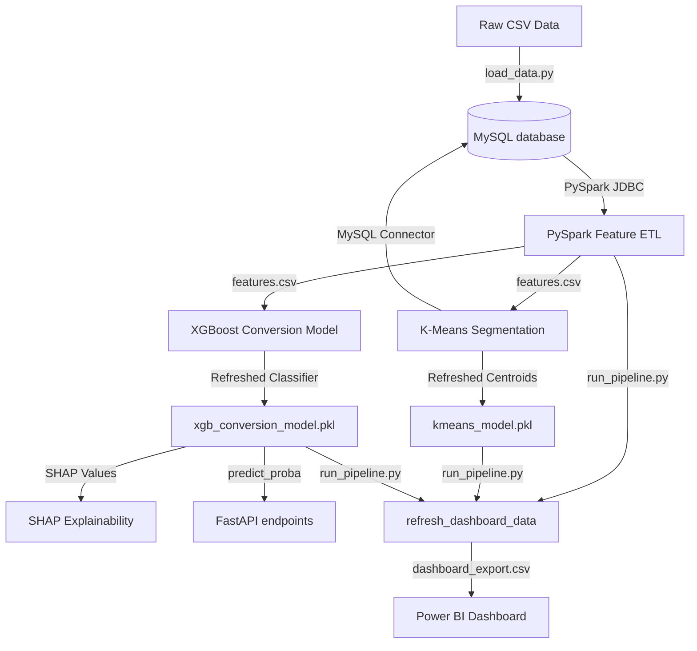

# 📊 Marketing Intelligence System — End-to-End Build

This repository contains a production-grade, end-to-end data science and engineering system designed to optimize marketing campaign targeting. It transforms a flat, untargeted marketing campaign dataset into structured tables, engineers features at scale, runs unsupervised & supervised machine learning models, explains predictions using SHAP values, serves inferences via FastAPI, automates pipelines with Apache Airflow, and visualizes outcomes in Power BI.

---

## 🏗️ Project Architecture & Data Flow



---

## 🛠️ Tech Stack & Dependencies

* **Database**: MySQL (relational star schema across 4 tables with integrity constraints)
* **Data Processing**: PySpark (feature engineering, aggregations, ratios, and tenure calculations)
* **Modeling & ML**: scikit-learn (K-Means), XGBoost (binary classifier), imbalanced-learn (SMOTE for class imbalance)
* **Model Explainability**: SHAP (global feature importance beeswarms & local waterfall/force plots)
* **API Delivery**: FastAPI + Uvicorn (real-time single & batch prediction endpoints)
* **Pipeline Automation**: Apache Airflow (DAG containing 5 validation and execution tasks)
* **Visualization**: Power BI (Executive Summary, Customer Intelligence, and Campaign Analytics dashboard)

---

## 🚀 Step-by-Step Setup & Execution

### 1. Database Setup
Ensure MySQL Server is running locally. Copy `.env.example` to `.env` and fill in your MySQL credentials:
```bash
cp .env.example .env
```
Run schema creation and import raw data:
```bash
python database/load_data.py
```
This cleans the raw data (filling income nulls, mapping marital statuses) and loads 2,240 rows into 4 tables: `customers`, `customer_spending`, `customer_engagement`, and `campaign_responses`.

### 2. Standalone Pipeline Run
Validate that the entire data pipeline compiles and runs successfully. The pipeline runs end-to-end (PySpark ETL -> Model Scoring -> KMeans Segmentation -> MySQL Segment Updates -> Power BI Export) using a standalone test runner (mocked so Airflow package installation is not required):
```bash
# Dry run validation
python airflow/run_pipeline.py --all --dry-run

# Run full pipeline
python airflow/run_pipeline.py --all
```
* **Expected runtime**: ~21 seconds.
* **Outputs generated**: `features.csv`, `conversion_scores.csv`, `customer_segments.csv`, `kmeans_model.pkl`, and `dashboard_export.csv`.

### 3. Serving Predictions (FastAPI)
Run the FastAPI web server locally:
```bash
uvicorn api.main:app --reload --host 0.0.0.0 --port 8000
```
* **Interactive API Docs (Swagger UI)**: Open [http://localhost:8000/docs](http://localhost:8000/docs) in your browser.
* **Health Check**: `GET /health` returns model version, state, and metrics.
* **Single Prediction**: Send `POST /predict-conversion` to get conversion probability, priority targeting recommendation, and customer segment.

---

## 📈 Machine Learning & Model Performance

### Unsupervised Segmentation (K-Means)
A K-Means clustering model ($k=4$) assigns customers into one of 4 behavioral profiles:
* **VIP**: Low recency, high purchase frequency, high monetary spend (Centroid conversion probability: **33.38%**).
* **New**: Very recent join dates, low spend, low history (Centroid conversion probability: **15.95%**).
* **At Risk**: High recency, historically high spend, inactive recently (Centroid conversion probability: **17.80%**).
* **Loyal**: High recency, low spend, low purchase counts (Centroid conversion probability: **4.57%**).

### Supervised Classification (XGBoost)
* **Target Label**: `Response` (1 if accepted the final campaign, 0 if not).
* **Class Imbalance**: Handles 85/15 target imbalance using SMOTE on training folds.
* **Hyperparameters**: Tuned via grid search.
* **Evaluation Metrics**:
  * **AUC-ROC**: `0.8779` (Target was >0.78)
  * **Precision (High Priority threshold @0.6)**: `63.8%` (6 out of 10 targeted customers convert)
  * **Recall**: `55.2%`
* **Top SHAP Features**: `campaign_engagement_rate` (historical campaign responsiveness) is the single strongest positive driver, followed by `income_per_person` and `total_spend`.

---

## 💰 Quantified Business Outcomes (For Interview Discussion)

If the marketing team continues to target *every* customer with every campaign (Untargeted Baseline):
* **Baseline Cost**: $6,720.00
* **Baseline Revenue**: $3,674.00
* **Net Value / Loss**: **-$3,046.00 (-45.33% ROI)**

Using the XGBoost model to target only **High Priority** conversion customers (probability > 0.60):
* **Targeted Cost**: $846.00 (targeting only 282 customers)
* **Targeted Revenue**: $1,969.00 (expected ~179 conversions)
* **Net Value / Profit**: **+$1,123.00 (132.74% ROI)**
* **Cost Savings**: **$5,874.00** saved in contact costs.
* **Targeting Efficiency**: Targeting **12.6%** of customers captures **53.6%** of all potential conversions!

---

## 📊 Power BI Dashboard Spec (`dashboard/README.md`)

Connect directly to MySQL (`marketing_db`) and import the generated `dashboard_export.csv` to build a 3-page interactive report:
1. **Page 1: Executive Summary**: Compare untargeted baseline economics vs ML-optimized ROI ($5,874 cost savings, +178% ROI Lift).
2. **Page 2: Customer Intelligence**: Show segment distributions, income vs spend scatter plots, and total revenue at risk ($622,343 of at-risk spend).
3. **Page 3: Campaign Analytics**: Track acceptance rates by campaign, identify multi-campaign responders, and segment channel usage matrix.

*Detailed DAX measure code, visual layouts, and the ODBC connector setup guide are documented inside [dashboard/README.md](file:///d:/DataScience/dashboard/README.md).*
